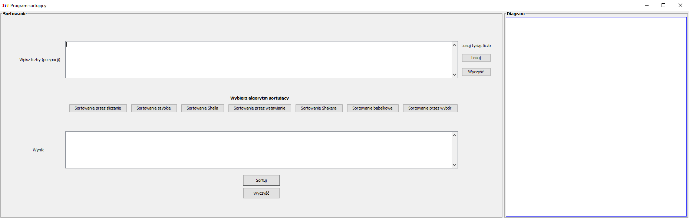

#Program sortujący

---
Program sortuje wszystkie podane liczby, dzięki różnym algorytmom. Do wyboru są:
- sortowanie Shella
- sortowanie szybkie
- sortowanie bąbelkowe
- sortowanie Shakera
- sortowanie przez wstawianie
- sortowanie przez zliczanie
- sortowanie przez wybór

W czasie rzeczywistym pokazuje na diagramie podgląd wartości w trakcie sortowania. Po zakończeniu sortowania wyświetlany jest wynik oraz czas, który był potrzebny do posortowania liczb. :1234: :clock1:

---
Autor: Dawid Paszko